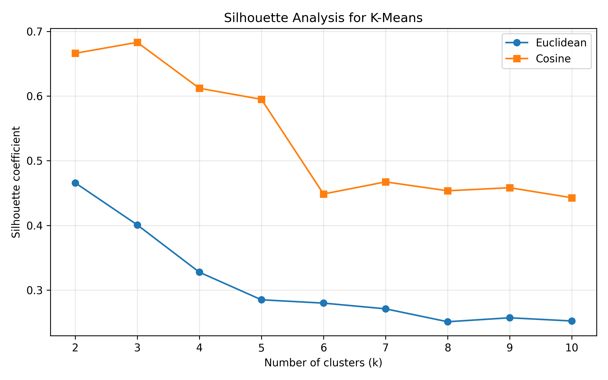
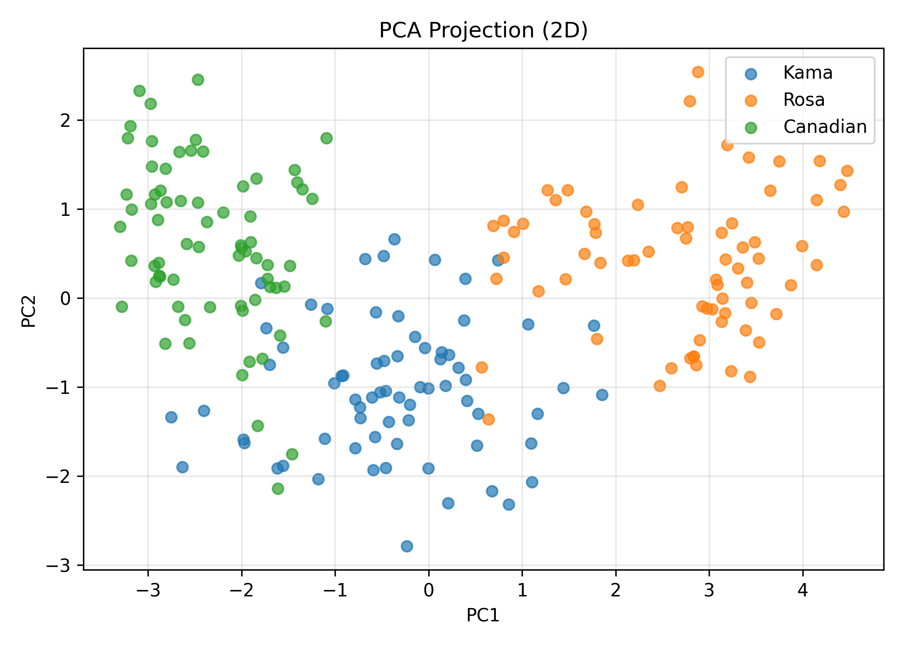
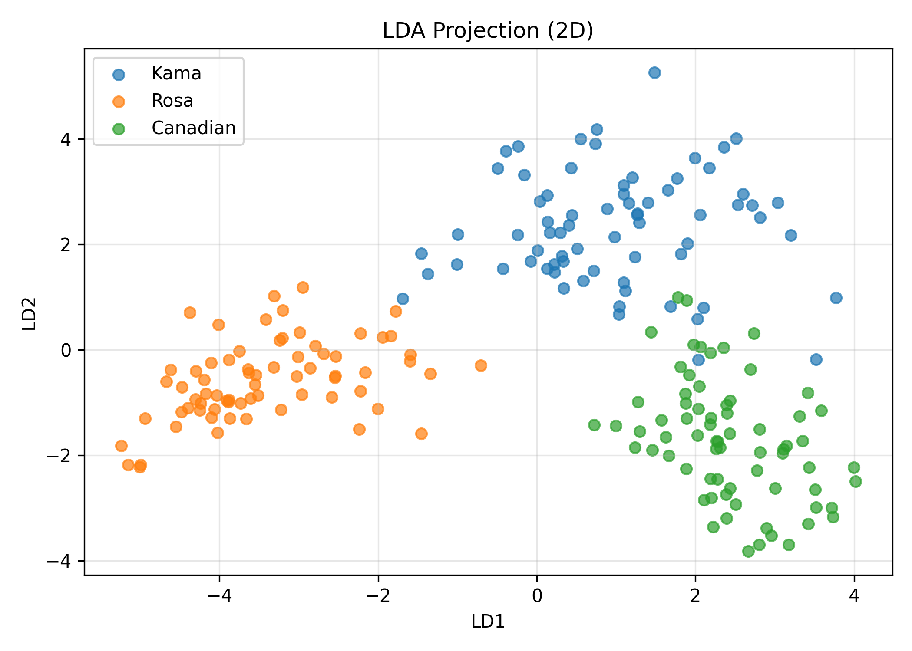
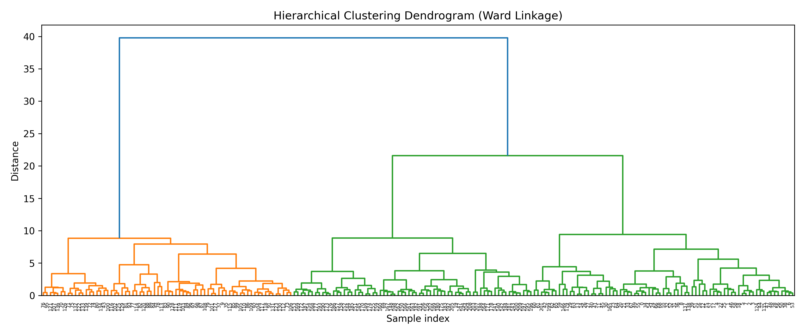

# Seeds Dataset Analysis: Clustering & Dimensionality Reduction

This project explores the **Seeds dataset** from the UCI Machine Learning Repository using clustering and dimensionality reduction techniques.

The goal is to understand the structure of the data, evaluate clustering performance, and visualize class separation.

---

## Dataset

- Source: UCI Machine Learning Repository  
- Dataset: Seeds  
- Link: https://archive.ics.uci.edu/dataset/236/seeds  

The dataset contains **210 samples** of wheat seeds from three varieties:
- Kama
- Rosa
- Canadian

Each sample is described by **7 morphological features**.

---

## Methods Used

### Clustering
- K-Means (Euclidean & Cosine)
- Hierarchical Clustering (Ward, Single, Complete, Average)

### Evaluation Metrics
- Silhouette Coefficient
- Rand Index
- Adjusted Rand Index (ARI)
- Normalized Mutual Information (NMI)

### Dimensionality Reduction
- Principal Component Analysis (PCA)
- Linear Discriminant Analysis (LDA)

---

## Key Results

- K-Means with **Euclidean distance** achieved better alignment with true labels than cosine similarity.
- The dataset shows **high cluster separability**, confirmed by both silhouette scores and Rand Index.
- Hierarchical clustering (Ward linkage) produced results comparable to k-means.
- PCA revealed that most variance can be captured with a small number of components.
- LDA provided **clear class separation**, outperforming PCA for visualization.
- Feature analysis identified the most discriminative characteristics of the seeds.

---

## Project Structure
├── data/

│ └── seeds_dataset.txt

├── results/

│ ├── silhouette_analysis.png

│ ├── dendrogram_ward.png

│ ├── pca_variance.png

│ ├── pca_reconstruction_error.png

│ ├── pca_2d.png

│ └── lda_2d.png

├── notebooks/

│ └── seeds_analysis.ipynb

├── README.md

└── requirements.txt


---

## How to Run

1. Clone the repository:
```bash
git clone https://github.com/daf-tsal/seeds-analysis.git
cd seeds-analysis
```
2. Install dependencies:
```python
pip install -r requirements.txt
```
3. Open the notebook:
```bash
jupyter notebook
```
Insights

The Seeds dataset has a well-defined structure, making it suitable for clustering algorithms.

Euclidean distance works better than cosine similarity for this dataset.

LDA is more effective than PCA for class separation because it uses label information.

License

This project uses data from the UCI Machine Learning Repository for educational and research purposes.

## Visualizations

### Silhouette Analysis


### PCA Projection


### LDA Projection


### Hierarchical Clustering (Dendrogram)

